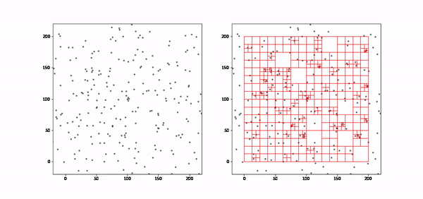
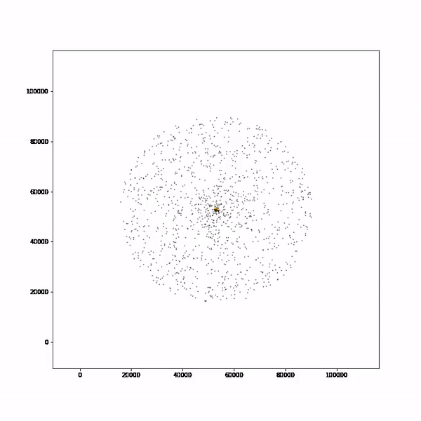

<div align="center">

# ✨ Barnes-Hut N-Body Simulation

**A Python library for simulating thousands of self-gravitating particles — fast.**

[](https://python.org)
[](LICENSE.md)
[-orange?style=flat-square)]()
[]()

<br>

*Two galaxies colliding — 8,000 particles, Barnes-Hut tree, leapfrog integrator*

https://github.com/Astrojigs/Orbital-simulations/blob/main/Examples/Videos/galaxy_collision.mp4

<br>

*Single rotating galaxy — 3,000 particles*

https://github.com/Astrojigs/Orbital-simulations/blob/main/Examples/Videos/galaxy_3000.mp4

</div>

---

## What is this?

Simulating gravity between N particles the naive way costs **O(N²)** force calculations per step — for 10,000 particles that's 100 million pairs, every frame.

The **Barnes-Hut algorithm** cuts this to **O(N log N)** by building a quadtree over the particles and approximating distant groups as a single body at their center of mass. The error is controlled by a single parameter `theta` — smaller means more accurate, larger means faster.

This library gives you:

- 🌳 **Quadtree** with incremental mass/COM updates, softened forces, and max-depth guard
- 🔁 **Leapfrog integrator** (kick-drift-kick) for bounded energy drift over long runs
- 🌌 **Initial condition generators** — exponential disk, Plummer sphere, solar system, random uniform
- 📊 **Diagnostics** — KE, PE, total energy, momentum, center of mass
- 🎬 **Video export** via OpenCV
- ⚡ **8× speedup at N=2000**, growing rapidly with N

---

## Quickstart

```python
from barnes_hut import Simulation, make_exponential_disk

# 500-particle galaxy
particles = make_exponential_disk(n=500, G=0.1)
sim = Simulation(particles, G=0.1, theta=0.6, eps=0.15, dt=0.06)

# Run 300 steps with live display
sim.run(n_steps=300, show=True, viewport=(-45, 45, -45, 45))

# Diagnostics
print(sim.kinetic_energy())
print(sim.total_momentum())
```

```python
# Galaxy collision
from barnes_hut import make_exponential_disk, Simulation

big   = make_exponential_disk(n=5000, center=(-28, 6),  rotation=+1)
small = make_exponential_disk(n=3000, center=( 28, -6), rotation=-1)

for p in big:   p.vx += 1.9
for p in small: p.vx -= 1.5

sim = Simulation(big + small, G=0.1, theta=0.75, eps=0.22, dt=0.09)
sim.run(n_steps=200, show=True, save_video="collision.mp4")
```

---

## Installation

```bash
git clone https://github.com/Astrojigs/Orbital-simulations.git
cd Orbital-simulations
pip install numpy matplotlib          # core
pip install opencv-python             # optional — for video export
```

---

## Performance

Measured on a single CPU core, Python 3.10:

| N particles | Barnes-Hut | Direct O(N²) | Speedup |
|:-----------:|:----------:|:------------:|:-------:|
| 100         | 0.005s     | 0.005s       | 1×      |
| 500         | 0.043s     | 0.129s       | 3×      |
| 1,000       | 0.110s     | 0.529s       | 5×      |
| 2,000       | 0.284s     | 2.205s       | 8×      |
| 5,000       | 0.930s     | ~14s (est.)  | ~15×    |
| 10,000      | 2.311s     | ~55s (est.)  | ~24×    |

Scaling law measured: **t ~ N^1.26** (Barnes-Hut) vs **t ~ N^1.90** (Direct).
Fitting against N log N gives t ~ (N log N)^1.08 — essentially linear.

---

## Gallery

### Quadtree decomposition



*Left: particle positions. Right: live quadtree cells — finer near dense regions, coarser in empty space.*

### Galaxy simulation



---

## API

### Core classes

```python
Point(x, y, mass=1.0, vx=0.0, vy=0.0)   # a particle
Rectangle(cx, cy, w, h)                   # axis-aligned bounding box
Quadtree(boundary, theta, capacity, eps)  # Barnes-Hut tree node
```

### Simulation

```python
sim = Simulation(particles, G, theta, eps, dt)

sim.step()                        # one leapfrog step
sim.run(n_steps, show=True, ...)  # many steps with optional rendering
```

`run()` keyword arguments:

| Argument | Default | Description |
|----------|---------|-------------|
| `show` | `False` | Live matplotlib display |
| `draw_tree` | `False` | Overlay quadtree grid |
| `viewport` | `None` | Fixed `(xmin,xmax,ymin,ymax)` camera |
| `save_video` | `None` | Path to export `.mp4` (needs OpenCV) |
| `video_fps` | `30` | Frames per second |
| `callback` | `None` | `fn(sim, step)` called each step |

### Initial conditions

```python
make_exponential_disk(n, R_d, M_total, G, bulge_frac, rotation, center, ...)
make_plummer_sphere(n, M_total, a, G, center, ...)
make_random_uniform(n, width, mass_range, v_max, ...)
make_solar_system()   # Sun + 8 planets, real SI masses & velocities
```

### Diagnostics

```python
kinetic_energy(points)
potential_energy(points, G, eps)   # O(N²) — use sparingly
total_energy(points, G, eps)
total_momentum(points)             # returns (px, py)
center_of_mass(points)             # returns (cx, cy)
direct_nbody_step(points, dt, G)   # exact O(N²) step, for comparison
```

### Quadtree queries

```python
tree = build_tree(particles, theta=0.5, eps=0.01)

tree.n_particles          # total particles in subtree
tree.mass                 # total mass
tree.center_of_mass()     # (com_x, com_y)
tree.depth()              # max depth below this node
tree.count_nodes()        # total node count
tree.nw / .ne / .sw / .se # child quadrants
tree.draw(ax)             # visualise cells
tree.draw_com(ax)         # visualise center of mass
```

---

## Repository structure

```
├── barnes_hut.py                                  # entire library
├── __init__.py                                    # package exports
│
├── Examples/
│   ├── Using_barnes_hut.ipynb                     # full tutorial (6 sections)
│   └── Videos/
│       ├── galaxy_3000.mp4                        # single galaxy, N=3000
│       └── galaxy_collision.mp4                   # merger, N=5000+3000
│
├── Barnes-hut Algorithm Animations.ipynb          # N=360 / 9600 / 19600 runs
├── Original Gravity Animation.ipynb               # direct solver — planets & solar system
├── Gravity Animation with potential contour.ipynb # potential field visualisation
│
├── Outputs/
│   ├── GIF/                                       # animated previews
│   ├── Videos/                                    # older simulation recordings
│   └── Images/
│
└── LICENSE.md
```

---

## How the algorithm works

```
For each time step:
  1. Build quadtree  — O(N log N)
     └─ Each node stores total mass + center of mass of its subtree

  2. Compute forces  — O(N log N)
     └─ For each particle, walk the tree:
          if  (cell_size / distance) < theta  →  treat cell as single body
          else                                →  recurse into children

  3. Leapfrog KDK integrator
     └─ half-kick velocities  →  drift positions  →  rebuild tree
        →  recompute accelerations  →  half-kick velocities
```

The `theta` parameter is the accuracy knob:
- `theta = 0` → exact O(N²) (every cell is opened)
- `theta = 0.5` → ~1–2% force error, good accuracy
- `theta = 1.0` → ~5–10% force error, maximum speed

---

## Contributing

Bug reports, feature requests and pull requests are welcome on [GitHub](https://github.com/Astrojigs/Orbital-simulations).

## License

[MIT](LICENSE.md) — free to use, modify, and distribute.

## Acknowledgements

Thanks to [@iamstarstuff](https://github.com/iamstarstuff) for support throughout development, and to J. Barnes & P. Hut for the [original 1986 paper](https://www.nature.com/articles/324446a0).
